# SYSTEM ARCHITECTURE
**AccessAI Bot - Complete System Architecture Documentation**  
*Last Updated: February 12, 2026*

---

## Table of Contents
1. [System Overview](#system-overview)
2. [Architecture Diagram](#architecture-diagram)
3. [Technology Stack](#technology-stack)
4. [System Components](#system-components)
5. [Data Flow](#data-flow)
6. [Security Architecture](#security-architecture)
7. [Deployment Architecture](#deployment-architecture)
8. [API Endpoints](#api-endpoints)
9. [Database Schema](#database-schema)
10. [Integration Points](#integration-points)

---

## System Overview

**AccessAI** is a comprehensive, multi-modal AI assistant platform with accessibility features, real-time communication, gesture recognition, and emergency alert capabilities. The system follows a **microservices architecture** with multiple backend services supporting a React-based frontend.

### Key Features
- 🤖 AI-powered chat assistant (Google Gemini)
- 🦾 Hand gesture recognition system
- 🌐 Multi-language translation
- 🆘 Emergency SOS alert system (SMS/Email)
- 🗣️ Natural Language Processing (NLP)
- 📁 File upload & processing
- 🔍 Google Search integration
- 📊 Real-time data monitoring
- 🔐 Multi-method authentication (Email, Phone, Google)
- 🔄 Firebase-MongoDB synchronization

---

## Architecture Diagram

```mermaid
graph TB
    subgraph "Client Layer"
        UI[React Frontend<br/>Vite + TailwindCSS]
        UI_Components[Components:<br/>Chat, Translator, Gesture,<br/>SOS, FileUpload, Settings]
    end

    subgraph "Authentication Layer"
        FirebaseAuth[Firebase Authentication]
        AuthMethods[Email/Phone/Google<br/>Sign-In Methods]
    end

    subgraph "Frontend Services"
        NLPService[NLP Service]
        TranslationSvc[Translation Service]
        RealTimeSvc[Real-Time Data Service]
        SearchSvc[Google Search Service]
        EmergencySvc[Emergency Contact Service]
    end

    subgraph "Backend Services - Node.js"
        ExpressAPI[Express Server<br/>Port 3001]
        SMSHandler[SMS Handler<br/>Twilio]
        EmailHandler[Email Handler<br/>Nodemailer]
    end

    subgraph "Backend Services - Python/Flask"
        GestureAPI[Gesture Recognition API<br/>gesture_api_server_simple.py]
        TranslateAPI[Translation API<br/>translate_api.py]
        ImageGenAPI[Image Generator API<br/>image_generator.py]
        NLPProcessor[NLP Processor<br/>nlp_processor.py]
    end

    subgraph "AI/ML Services"
        GeminiAPI[Google Gemini API<br/>@google/genai]
        TensorFlow[TensorFlow<br/>Hand Gesture Model]
        OpenAI[OpenAI API<br/>Translation]
        UnsplashAPI[Unsplash API<br/>Image Search]
    end

    subgraph "Data Layer"
        Firestore[Firebase Firestore<br/>Real-time Database]
        MongoDB[(MongoDB<br/>Data Persistence)]
        SyncService[Firebase-MongoDB<br/>Sync Service]
    end

    subgraph "External Services"
        Twilio[Twilio SMS<br/>Emergency Alerts]
        Gmail[Gmail SMTP<br/>Email Service]
        GoogleSearch[Google Search API<br/>Web Search]
    end

    %% Client connections
    UI --> UI_Components
    UI --> FirebaseAuth
    UI --> Firestore
    UI_Components --> NLPService
    UI_Components --> TranslationSvc
    UI_Components --> RealTimeSvc
    UI_Components --> SearchSvc
    UI_Components --> EmergencySvc

    %% Authentication flow
    FirebaseAuth --> AuthMethods
    AuthMethods --> UI

    %% Backend API connections
    UI_Components --> ExpressAPI
    UI_Components --> GestureAPI
    UI_Components --> TranslateAPI
    UI_Components --> ImageGenAPI

    ExpressAPI --> SMSHandler
    ExpressAPI --> EmailHandler
    SMSHandler --> Twilio
    EmailHandler --> Gmail

    %% AI/ML connections
    UI --> GeminiAPI
    GestureAPI --> TensorFlow
    TranslateAPI --> OpenAI
    ImageGenAPI --> UnsplashAPI
    NLPProcessor --> NLPService
    SearchSvc --> GoogleSearch

    %% Data layer connections
    Firestore --> SyncService
    SyncService --> MongoDB
    ExpressAPI --> MongoDB
    GestureAPI --> MongoDB

    style UI fill:#4F46E5,stroke:#312E81,color:#fff
    style FirebaseAuth fill:#FF9800,stroke:#E65100,color:#fff
    style ExpressAPI fill:#68A063,stroke:#4A7C59,color:#fff
    style GestureAPI fill:#3776AB,stroke:#2C5F8D,color:#fff
    style GeminiAPI fill:#DB4437,stroke:#A73329,color:#fff
    style Firestore fill:#FFA000,stroke:#F57C00,color:#fff
    style MongoDB fill:#47A248,stroke:#3B8A3A,color:#fff
```



---

## Technology Stack

### Frontend
| Technology | Purpose | Version |
|------------|---------|---------|
| **React** | UI Framework | 19.2.0 |
| **Vite** | Build Tool & Dev Server | 7.2.4 |
| **TailwindCSS** | Styling Framework | 4.1.18 |
| **Lucide React** | Icon Library | 0.562.0 |
| **Firebase SDK** | Authentication & Database | 12.7.0 |

### Backend - Node.js
| Technology | Purpose | Version |
|------------|---------|---------|
| **Express** | Web Server Framework | 4.22.1 |
| **Twilio** | SMS Service | 4.23.0 |
| **Nodemailer** | Email Service | 6.10.1 |
| **MongoDB Driver** | Database Client | 7.1.0 |
| **CORS** | Cross-Origin Support | 2.8.6 |

### Backend - Python
| Technology | Purpose | Version |
|------------|---------|---------|
| **Flask** | Web Framework | Latest |
| **TensorFlow** | ML Framework | Latest |
| **OpenCV** | Computer Vision | Latest |
| **PyMongo** | MongoDB Driver | Latest |
| **python-dotenv** | Environment Management | Latest |

### AI & ML Services
| Service | Purpose | API |
|---------|---------|-----|
| **Google Gemini** | Conversational AI | @google/genai |
| **TensorFlow.js** | Client-side ML | 4.22.0 |
| **MediaPipe** | Hand Detection | Hand Landmarker |
| **OpenAI** | Translation & NLP | REST API |
| **Unsplash** | Image Generation | REST API |

### Databases
| Database | Purpose | Type |
|----------|---------|------|
| **Firebase Firestore** | Real-time chat data, user sessions | NoSQL (Document) |
| **MongoDB** | Persistent storage, analytics | NoSQL (Document) |

---

## System Components

### 1. Frontend Application (React + Vite)

#### Core Components
```
src/
├── App.jsx                    # Main application component
├── main.jsx                   # Application entry point
├── components/
│   ├── Login.jsx              # Authentication UI
│   ├── ChatSidebar.jsx        # Chat history & navigation
│   ├── GestureRecognition.jsx # Hand gesture detection
│   ├── Translator.jsx         # Language translation
│   ├── SOS.jsx                # Emergency alert system
│   ├── FileUpload.jsx         # File handling
│   ├── Settings.jsx           # User preferences
│   ├── EmergencyContactsManager.jsx
│   ├── PerformanceMonitor.jsx # System metrics
│   └── RealTimeDataMonitor.jsx
├── services/
│   ├── NLPService.js          # Natural language processing
│   ├── TranslationService.js  # Translation logic
│   ├── RealTimeDataService.js # Real-time updates
│   ├── GoogleSearchService.js # Web search
│   └── EmergencyContactService.js
├── hooks/
│   ├── useSparklerTrail.js    # UI effects
│   └── useCursorTrail.js
└── utils/
    └── validation.js          # Input validation
```

#### Key Features
- **Real-time Chat**: WebSocket-based communication via Firestore
- **Code Highlighting**: Syntax highlighting using highlight.js
- **Responsive Design**: Mobile-first approach with TailwindCSS
- **State Management**: React hooks for local state
- **Performance Optimization**: Lazy loading and memoization

### 2. Authentication Service (Firebase)

#### Supported Methods
1. **Email/Password Authentication**
   - Email verification with OTP
   - Password reset functionality
   - Secure session management

2. **Phone Authentication**
   - SMS-based OTP verification
   - International phone number support
   - Country code selection

3. **Google OAuth**
   - One-click sign-in
   - Profile information sync

#### Security Features
- JWT token-based authentication
- Automatic session refresh
- Secure credential storage
- Rate limiting on auth attempts

### 3. Backend Services

#### A. Express Server (Node.js)
**File**: `server.js`  
**Port**: 3001  
**Purpose**: Emergency alert backend

**Key Endpoints**:
```javascript
POST /api/send-emergency-sms
POST /api/send-emergency-email
GET /health
```

**Dependencies**:
- Twilio SDK for SMS
- Nodemailer for Email
- MongoDB for logging

**Features**:
- Emergency SMS alerts
- Email notifications
- Contact management
- Alert history tracking

#### B. Gesture Recognition Server (Python/Flask)
**File**: `gesture_api_server_simple.py`  
**Port**: 5000  
**Purpose**: Hand gesture detection and recognition

**Key Endpoints**:
```python
GET /health
POST /upload
POST /predict_gesture
POST /process_nlp
GET /tts
```

**ML Model**:
- TensorFlow-based gesture classifier
- MediaPipe hand landmark detection
- Custom-trained model on Indian sign language
- Real-time prediction with confidence scores

**Features**:
- Hand landmark detection (21 keypoints)
- Gesture classification
- Tamil TTS support
- NLP integration
- File processing (PDF, DOCX, PPTX)

#### C. Translation Server (Python/Flask)
**File**: `translate_api.py`  
**Port**: 5001  
**Purpose**: Multi-language translation

**Key Endpoints**:
```python
POST /api/translate
GET /api/languages
GET /health
```

**Translation Engine**:
- OpenAI API for high-quality translation
- Support for 15+ languages
- Context-aware translation
- Bidirectional translation

**Supported Languages**:
- English, Spanish, French, German
- Hindi, Tamil, Bengali
- Chinese, Japanese, Korean
- Portuguese, Russian, Arabic
- And more...

#### D. Image Generator (Python)
**File**: `image_generator.py`  
**Purpose**: Image generation from text prompts

**Features**:
- Unsplash API integration
- Image search by keywords
- High-quality image retrieval
- Image caching

#### E. NLP Processor (Python)
**File**: `nlp_processor.py`  
**Purpose**: Advanced natural language processing

**Features**:
- Intent detection
- Sentiment analysis
- Entity recognition
- Context understanding

### 4. Data Synchronization

#### Firebase-MongoDB Sync
**Files**:
- `firebase_mongo_sync.py`
- `sync_firebase_to_mongodb.py`
- `sync-firebase-to-mongodb.js`

**Purpose**: 
- Bidirectional data synchronization
- Data persistence and backup
- Analytics and reporting
- Offline functionality

**Sync Strategy**:
1. Real-time listeners on Firestore
2. Change detection and validation
3. Batch writes to MongoDB
4. Conflict resolution
5. Error handling and retry logic

---

## Data Flow

### 1. User Authentication Flow
```
User → Firebase Auth → Verify Credentials → Generate JWT →
Store in Firestore → Return User Object → Update UI
```

### 2. Chat Message Flow
```
User Input → Validation → Send to Firestore →
Real-time Listener → Display in UI →
AI Processing (Gemini) → Response Generation →
Store Response → Update UI
```

### 3. Gesture Recognition Flow
```
Webcam → MediaPipe Detection → Extract 21 Landmarks →
Send to Flask API → TensorFlow Model → Prediction →
Return Gesture + Confidence → Display in UI
```

### 4. Translation Flow
```
Input Text → Language Detection → Send to Translation API →
OpenAI Processing → Translated Text → Return to Frontend →
Display Translation
```

### 5. Emergency SOS Flow
```
SOS Trigger → Get Location → Fetch Emergency Contacts →
Compose Message → Send to Express Server →
Parallel Execution:
  ├─ Twilio SMS → Contact Phone Numbers
  └─ Nodemailer → Contact Emails
→ Log to MongoDB → Notify User → Update UI
```

### 6. File Upload Flow
```
User Selects File → Client Validation → Upload to Server →
Process Based on Type:
  ├─ PDF → Extract Text (PyPDF2)
  ├─ DOCX → Extract Text (python-docx)
  ├─ Image → OCR Processing
  └─ PPTX → Extract Slides
→ Return Processed Content → Display in Chat
```

---

## Security Architecture

### Authentication & Authorization
1. **Firebase Authentication**
   - Multi-factor authentication (MFA)
   - Secure token management
   - Session timeout (1 hour default)
   - Automatic token refresh

2. **API Security**
   - CORS configuration
   - API key validation
   - Rate limiting
   - Request sanitization

3. **Data Security**
   - Input validation on all endpoints
   - XSS prevention
   - SQL injection protection
   - Secure credential storage

### Environment Variables
All sensitive credentials stored in `.env` files:
```
FIREBASE_API_KEY
GOOGLE_GEMINI_API_KEY
OPENAI_API_KEY
TWILIO_ACCOUNT_SID
TWILIO_AUTH_TOKEN
MONGODB_URI
EMAIL_USER
EMAIL_PASSWORD
UNSPLASH_ACCESS_KEY
```

### Data Privacy
- End-to-end encryption for messages
- Personal data anonymization
- GDPR compliance
- User data deletion on request
- Audit logging

---

## Deployment Architecture

### Development Environment
```
Frontend: http://localhost:5173 (Vite Dev Server)
Express API: http://localhost:3001
Gesture API: http://localhost:5000
Translation API: http://localhost:5001
```

### Production Environment (Recommended)

#### Frontend
- **Platform**: Vercel / Netlify / Firebase Hosting
- **CDN**: Cloudflare
- **Build**: `npm run build`
- **Output**: `dist/`

#### Backend Services
- **Node.js**: Heroku / Railway / AWS EC2
- **Python**: Google Cloud Run / AWS Lambda / DigitalOcean
- **Container**: Docker images

#### Databases
- **Firebase**: Managed by Google
- **MongoDB**: MongoDB Atlas (Cloud)

#### File Storage
- Firebase Storage for uploads
- CDN for static assets

### Scaling Strategy
1. **Horizontal Scaling**: Multiple server instances
2. **Load Balancing**: NGINX / AWS ALB
3. **Caching**: Redis for frequent queries
4. **CDN**: Static asset distribution
5. **Database Sharding**: MongoDB clusters

---

## API Endpoints

### Express Server (Port 3001)

#### Emergency SMS
```http
POST /api/send-emergency-sms
Content-Type: application/json

{
  "phone": "+1234567890",
  "message": "Emergency alert message",
  "userId": "user123",
  "contactName": "John Doe"
}
```

**Response**:
```json
{
  "success": true,
  "messageId": "SM1234567890",
  "message": "SMS sent successfully"
}
```

#### Emergency Email
```http
POST /api/send-emergency-email
Content-Type: application/json

{
  "email": "emergency@example.com",
  "subject": "Emergency Alert",
  "message": "Emergency message content",
  "userId": "user123"
}
```

### Gesture Recognition API (Port 5000)

#### Predict Gesture
```http
POST /predict_gesture
Content-Type: application/json

{
  "landmarks": [[x1, y1, z1], [x2, y2, z2], ...],
  "handedness": "Right"
}
```

**Response**:
```json
{
  "gesture": "thumbs_up",
  "confidence": 0.95,
  "alternatives": [
    {"gesture": "open_palm", "confidence": 0.03}
  ]
}
```

#### Upload File
```http
POST /upload
Content-Type: multipart/form-data

file: [binary data]
```

#### Health Check
```http
GET /health
```

### Translation API (Port 5001)

#### Translate Text
```http
POST /api/translate
Content-Type: application/json

{
  "text": "Hello, world!",
  "source_language": "en",
  "target_language": "es"
}
```

**Response**:
```json
{
  "success": true,
  "translated_text": "¡Hola, mundo!",
  "source_language": "en",
  "target_language": "es"
}
```

#### Get Supported Languages
```http
GET /api/languages
```

---

## Database Schema

### Firebase Firestore

#### Collection: `users`
```javascript
{
  uid: string,              // Firebase user ID
  email: string,            // User email
  displayName: string,      // User name
  phoneNumber: string,      // Phone number
  photoURL: string,         // Profile picture
  createdAt: timestamp,     // Account creation
  lastLogin: timestamp,     // Last login time
  preferences: {
    language: string,
    theme: string,
    notifications: boolean
  }
}
```

#### Collection: `chats`
```javascript
{
  chatId: string,           // Unique chat ID
  userId: string,           // Owner user ID
  title: string,            // Chat title
  createdAt: timestamp,     // Creation time
  updatedAt: timestamp,     // Last update
  model: string,            // AI model used
  archived: boolean         // Archive status
}
```

#### Collection: `messages`
```javascript
{
  messageId: string,        // Unique message ID
  chatId: string,           // Parent chat ID
  userId: string,           // Sender user ID
  role: string,             // 'user' or 'assistant'
  content: string,          // Message text
  timestamp: timestamp,     // Send time
  tokens: number,           // Token count
  metadata: {
    model: string,
    temperature: number,
    promptTokens: number,
    completionTokens: number
  }
}
```

#### Collection: `emergencyContacts`
```javascript
{
  contactId: string,        // Unique contact ID
  userId: string,           // Owner user ID
  name: string,             // Contact name
  phone: string,            // Phone number
  email: string,            // Email address
  relationship: string,     // Relationship to user
  priority: number,         // Alert priority (1-5)
  createdAt: timestamp
}
```

### MongoDB

#### Collection: `chat_logs`
```javascript
{
  _id: ObjectId,
  userId: string,
  chatId: string,
  message: string,
  role: string,
  timestamp: ISODate,
  model: string,
  tokens: number,
  cost: number,
  metadata: object
}
```

#### Collection: `gesture_history`
```javascript
{
  _id: ObjectId,
  userId: string,
  gesture: string,
  confidence: number,
  timestamp: ISODate,
  landmarks: array,
  handedness: string
}
```

#### Collection: `emergency_alerts`
```javascript
{
  _id: ObjectId,
  userId: string,
  type: string,             // 'sms' or 'email'
  recipient: string,
  message: string,
  status: string,           // 'sent', 'failed', 'pending'
  location: {
    latitude: number,
    longitude number,
    address: string
  },
  timestamp: ISODate,
  deliveryTime: ISODate
}
```

---

## Integration Points

### 1. Firebase Integration
- **Authentication**: User sign-in/sign-up
- **Firestore**: Real-time database
- **Storage**: File uploads (if configured)
- **Analytics**: Usage tracking

### 2. Google Gemini AI
- **API**: @google/genai
- **Models**: gemini-pro, gemini-pro-vision
- **Features**: 
  - Conversational AI
  - Context awareness
  - Multi-turn conversations
  - Code generation

### 3. Twilio SMS
- **Service**: Programmable SMS
- **Features**:
  - International SMS
  - Delivery status
  - Two-way messaging

### 4. OpenAI
- **API**: Chat Completions
- **Use Cases**:
  - High-quality translation
  - Text generation
  - Content analysis

### 5. MongoDB Atlas
- **Connection**: MongoDB Driver
- **Features**:
  - Cloud-hosted database
  - Automatic backups
  - Scalable storage
  - Analytics support

---

## Performance Considerations

### Frontend Optimization
1. **Code Splitting**: Dynamic imports for routes
2. **Lazy Loading**: Components loaded on demand
3. **Memoization**: React.memo for expensive components
4. **Debouncing**: Input throttling for API calls
5. **Virtual Scrolling**: For long chat histories

### Backend Optimization
1. **Caching**: Redis for frequent queries
2. **Connection Pooling**: Database connections
3. **Async Processing**: Non-blocking operations
4. **Load Balancing**: Multiple server instances
5. **CDN**: Static asset delivery

### Database Optimization
1. **Indexing**: Key fields indexed
2. **Query Optimization**: Efficient queries
3. **Pagination**: Limited result sets
4. **Batch Operations**: Bulk writes
5. **Data Archiving**: Old data cleanup

---

## Monitoring & Logging

### Application Monitoring
- **Frontend**: Google Analytics, Sentry
- **Backend**: Winston logger, Morgan middleware
- **Performance**: Lighthouse, Web Vitals

### Error Tracking
- **Client Errors**: Console logs, Error boundaries
- **Server Errors**: Winston logs, Email alerts
- **Database Errors**: MongoDB logs, Atlas monitoring

### Metrics
- Response time
- API usage
- Error rates
- User engagement
- System uptime

---

## Future Enhancements

### Planned Features
1. **Voice Recognition**: Speech-to-text
2. **Video Chat**: WebRTC integration
3. **Mobile Apps**: React Native
4. **Offline Mode**: Service workers
5. **Advanced Analytics**: Usage dashboards
6. **Multi-tenancy**: Organization support
7. **Plugin System**: Extensible architecture
8. **AI Model Training**: Custom models
9. **Blockchain Integration**: Secure transactions
10. **AR/VR Support**: Immersive experiences

### Infrastructure Improvements
1. **Kubernetes**: Container orchestration
2. **GraphQL**: Unified API layer
3. **WebSockets**: Real-time communication
4. **ElasticSearch**: Advanced search
5. **Message Queue**: RabbitMQ/Kafka

---

## Development Workflow

### Local Development
```bash
# Install dependencies
npm install

# Start frontend (Vite)
npm run dev

# Start Express server
npm run server

# Start Python servers
python gesture_api_server_simple.py
python translate_api.py

# Run all services
npm start
```

### Testing
```bash
# Frontend tests
npm run test

# Backend tests
npm run test:server

# End-to-end tests
npm run test:e2e
```

### Deployment
```bash
# Build frontend
npm run build

# Deploy frontend
vercel deploy

# Deploy backend
docker build -t accessai-backend .
docker push accessai-backend
```

---

## Support & Maintenance

### Documentation
- User guides in `/docs`
- API documentation
- Component library
- Troubleshooting guides

### Version Control
- **Git**: Source control
- **Branching**: Feature branches
- **CI/CD**: GitHub Actions

### Backup Strategy
- Daily database backups
- Weekly full system backup
- Disaster recovery plan

---

## Conclusion

This system architecture provides a scalable, maintainable, and secure foundation for the AccessAI platform. The microservices approach allows independent scaling and deployment of different components, while the integration of Firebase and MongoDB ensures data reliability and real-time capabilities.

For questions or contributions, refer to [DEVELOPERS_GUIDE.md](DEVELOPERS_GUIDE.md).

**Architecture Version**: 1.0  
**Last Review**: February 12, 2026  
**Next Review**: May 12, 2026
